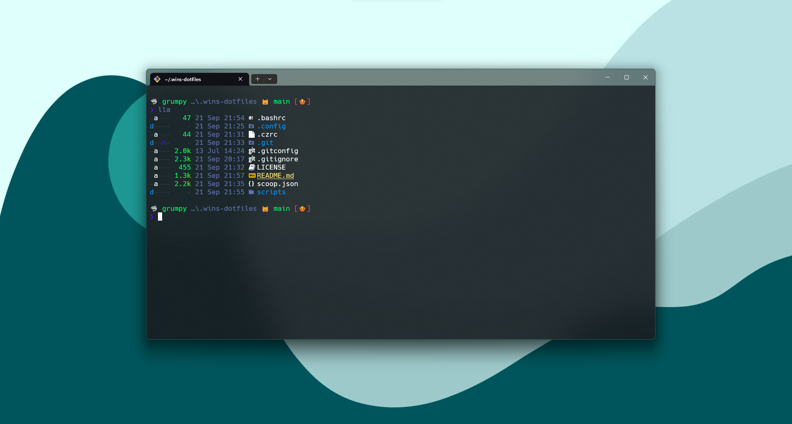

    <h1><code>💨</code> Windows's Dotfiles</h1>
    

        <strong>My personal dotfiles for Windows (Using <a href="https://gitforwindows.org/">Git Bash</a>)</strong>
    

    

## `📝` About

This repository contains my personal dotfiles for Windows. I use [Git Bash](https://gitforwindows.org/) as my main terminal emulator, so these dotfiles are intended to be used with it.

## `📃` Contents

- Git Bash configuration
- Git configuration
- Commitizen configuration

## `🎐` Git Bash configuration

- [Fish shell](https://fishshell.com/) - A smart and user-friendly command line shell. `bash scripts/install_fish.sh`
- [Starship](https://starship.rs/) - A blazing-fast, cross-shell prompt.
- [Scoop](https://scoop.sh/) - A command-line installer for Windows. `scoop import scoop.json`

## `🎐` Commitizen configuration

- [Commitizen](https://github.com/commitizen/cz-cli) - The commitizen command line utility. `npm install -g commitizen`
- [CZ Emoji Conventional Message](https://github.com/PunGrumpy/cz-emoji-conventional-message) - A commitizen adapter for the conventional changelog preset with emoji. `npm install -g cz-emoji-conventional-message`

## `📜` License

This repository is licensed under the [WTFPL License](LICENSE).
